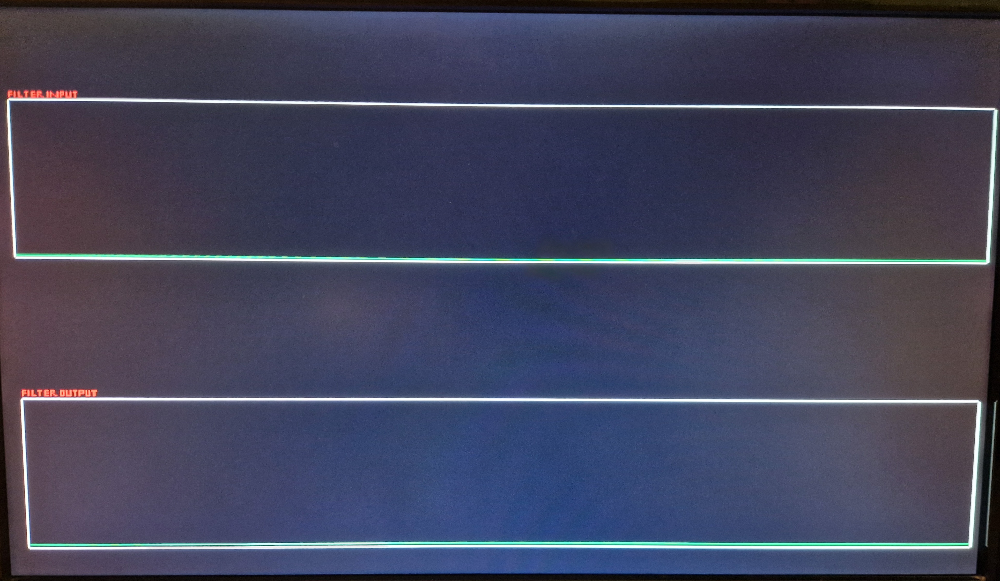
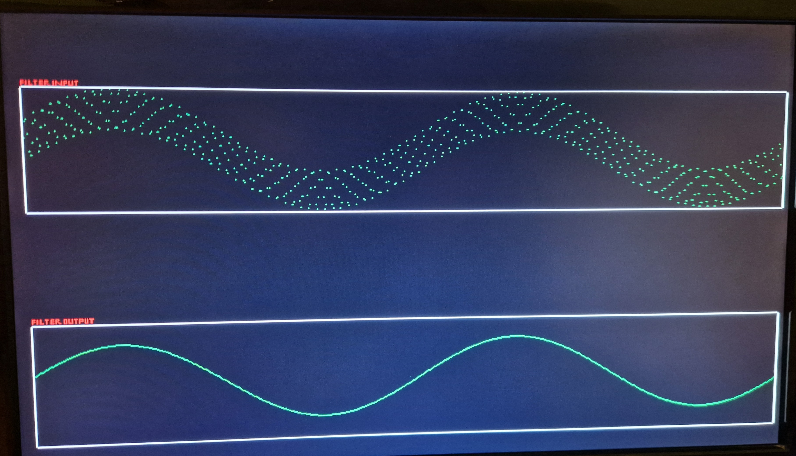
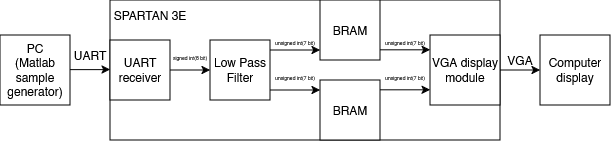

# FPGA Digital Filter with UART Input and VGA Visualization

A hardware digital FIR low-pass filter implemented on an FPGA, capable of receiving signal samples over UART and displaying both the original and filtered waveforms in real time via a VGA monitor.

> **Academic project** | Digital Systems / FPGA Design | VHDL | Xilinx Spartan-3E

-----

## Demonstration



`Display before receiving samples`

`Original vs. filtered signal`
-----

## Overview

The system receives 8-bit samples from a PC (generated in MATLAB as a sum of two sine waves — one low-frequency, one high-frequency), filters them using a custom FIR low-pass filter, and visualizes both signals side by side on a VGA display.

The design targets the **Elbert V2 development board** (Numato Lab) with a Xilinx Spartan-3E FPGA — a deliberately constrained platform that required creative solutions around limited memory and legacy tooling.

-----

## System Architecture



### Key Modules

|Module |Description |
|---------------|-------------------------------------------------------------------------|
|`uart_receiver`|Detects falling edge on RX, samples bits per UART frame (8N1 + parity) |
|`lpf26` |26-tap FIR low-pass filter; outputs both delayed-raw and filtered samples|
|`vga_display` |VGA signal generator; reads sample memory and renders waveforms |
|`bram`|621x7bit memory; infers bram|
|`top`|top module; instantiates all previous modules + digital clock manager|

### Signal Flow Details

- **Input:** 8-bit signed integers received via UART
- **Filter output:** 7-bit unsigned — scaled before display
- **Display memory:** 2 × (621×7 bits) — one buffer per signal; each element holds an amplitude value 0–127 representing the waveform at a given horizontal position
- **Rendering logic:** for each pixel column, if the stored amplitude matches the current scanline row → green pixel; otherwise → black background. Plot borders and labels are drawn in white.

-----

## Memory Design

A standard framebuffer at 640×480 resolution would require ~300 KB of storage — far exceeding the available block RAM on the Spartan-3E. The solution stores only one amplitude value per horizontal pixel column (rather than full pixel data), reducing memory to ~5.4 KB total while still enabling a smooth real-time waveform display.

-----

## Challenges

Working with this platform introduced several non-trivial constraints:

- **Limited FPGA resources** — The Spartan-3E operates near its capacity in this design. Every module required careful resource budgeting, especially around block RAM allocation.
- **Legacy toolchain (Xilinx ISE)** — Spartan-3E is not supported by Vivado. ISE has been discontinued, which limited access to modern IP cores and wizards.
- **Manual clock generation** — Without the Clocking Wizard, the 100 MHz system clock had to be instantiated and configured manually via the Digital Clock Manager (DCM) primitive.

-----

## Tools & Technologies

- **HDL:** VHDL
- **FPGA:** Xilinx Spartan-3E (Elbert V2 board)
- **Toolchain:** Xilinx ISE Design Suite
- **Signal generation:** MATLAB(Design)/Python(Testbenches)
- **Communication:** UART (USB bridge)
- **Output:** VGA (640×480)

-----

## Possible Future Improvements

- **Higher-order filter** — more taps for sharper roll-off, feasible on a larger device
- **Runtime-reconfigurable coefficients** — store multiple filter profiles in block RAM, switchable without reprogramming
- **Full framebuffer** — on a resource-rich platform, enables higher resolution and richer visualization (e.g., frequency spectrum, grid overlay)
- **Migrate to Vivado / modern FPGA** — unlocks IP cores, better timing analysis, and active toolchain support

-----

## Project Structure

```
├── constraints/
│ └── elbert_v2.ucf
├── design/
│ ├── uart_receiver.vhd
│ ├── lpf26.vhd
│ ├── bram.vhd
│ ├── top.vhd
│ └── vga_display.vhd
├── images/
│ ├── before_vs_after_filtration.jpg
│ ├── filter_schematic.png
│ ├── initial.jpg
├── scripts/
│ ├── generate_samples_lpf_tb.py
│ ├── generate_samples_top_tb.py
│ └── generate_uart_samples.m
├── tb/
│ ├── lpf_tb.vhd
│ ├── uart_receiver.vhd
│ ├── top_tb.vhd
│ └── vga_display_tb.vhd
└── README.md
```

-----

## About

This is a student portfolio project demonstrating end-to-end FPGA design: from hardware communication (UART) through signal processing (FIR filtering) to real-time visualization (VGA). Built under real hardware constraints on a legacy platform — which, while challenging, provided a thorough grounding in low-level digital design.
